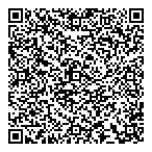

### Calendar Event

QR Code Generator for PHP can create vCalendar events with ease:

```php
<?php

use QR_Code\Types\QR_CalendarEvent;

$startDateAndTime = new \DateTime('next saturday 7pm');
$endDateAndTime = new \DateTime('next saturday 11pm');

$summary = 'Dinner date with Janet Doe';
$description = 'Important dinner date with Janet Doe, whom you\'ve met at Tinder, at Per Se (French Restaurant)';
$location = 'Time Warner Center, 10 Columbus Cir, New York, NY 10023, USA';

$event = new QR_CalendarEvent($startDateAndTime, $endDateAndTime, $summary, $description, $location);

$event->svg();
```

The above code should produce an SVG like this:



Because SVG is scalable, it is preferred instead of static images for transmitting complex information. 
