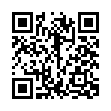

### Wi-fi Network Settings

To securely share your Wi-fi Network Settings, create a QR Code.

```php
<?php

use QR_Code\Types\QR_WiFi;

$authenticationType = "WPA2";
$ssId = "MySuperSSID";
$ssIdisHidden = false;
$password = "Y0uC4n7f1nd7h3p4ssw0rd";

$wifi = new QR_WiFi($authenticationType, $ssId, $password, $ssIdisHidden);

$wifi->png();
```

Then you can print and post it so your visitors can connect to your network:



### Note

iOS users will get a text with your settings. Android users will get their Wi-fi connection automatically configured. Blame Apple, it's not my fault.